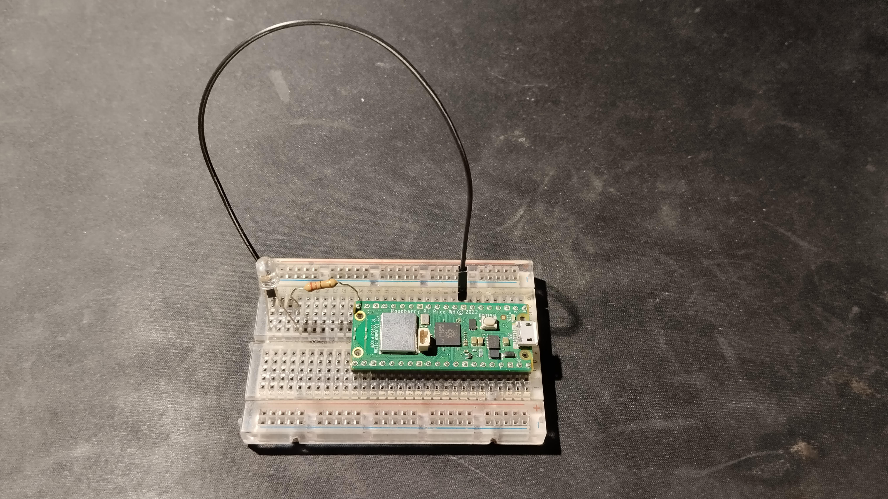
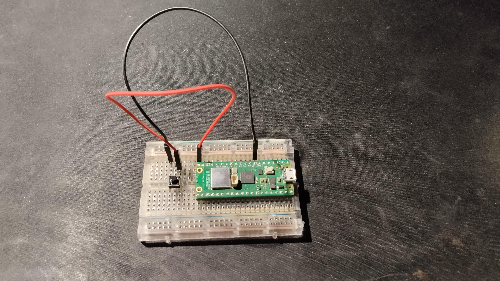

# Raspberry Pi Pico W Wireless Blink
A project that utilises the wireless chip on the raspberry pi pico w to create a network, on which a second pico w connects and controls an LED on the first.

## Components Used
* 2 Raspberry Pi Pico W Microcontrollers
* 2 Breadboards
* 4-pin Push Button
* White 5mm LED
* 220 Ω Resistor
* Jumper Wires

The LED is connected on the pico which acts as the access point, on GPIO pin 15 which is physical pin 20. The button is connected on the station pico, again on GPIO pin 15.

## Implementation
The access point pico sets up a DHCP server and waits for incoming connections. Station pico then connects to the access point. Using interrupts, when the button is pressed the station pico sends a UDP message to the access point pico. Expecting the message "Turn On", access point checks if the message received is correct. If it is correct the LED turns on for half a second. It then sends back an acknowledge message "Ack", indicating that it received the message. The acknowledge message is send even if the received message was not correct. Station receives the acknowledge message and if it is correct turns on the on-board LED.

## Images
Below is an image of the access point breadboard.

And also an image of the station breadboard.

## Binaries Folder
In case you are not interested in building the project, both the .uf2 and .elf files are included in the "binaries" folder, where they can be simply loaded on 2 pico boards.